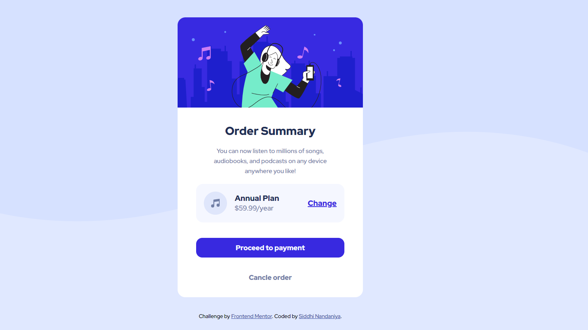

# Frontend Mentor - Order summary card solution

This is a solution to the [Order summary card challenge on Frontend Mentor](https://www.frontendmentor.io/challenges/order-summary-component-QlPmajDUj). Frontend Mentor challenges help you improve your coding skills by building realistic projects. 

## Table of contents

- [Overview](#overview)
  - [Screenshot](#screenshot)
  - [Links](#links)
- [Author](#author)

## Overview
This is my third Frontend Mentor project. I've created this project using CSS3 and HTML5. 

### Screenshot

### Links

- Live Site URL: https://Siddhie.github.io/Order-Summary/
- Solution URL: [https://www.frontendmentor.io/solutions/nftpreviewcard-using-html5-and-css3-AmY9EuZiz](https://www.frontendmentor.io/solutions/responsive-ordersummary-Z-7TQ08l2)

## Author

- Linkedin - [Siddhi Nandaniya](https://www.linkedin.com/in/siddhie/)
- Frontend Mentor - [@siddhinandaniya](https://www.frontendmentor.io/profile/Siddhie)

